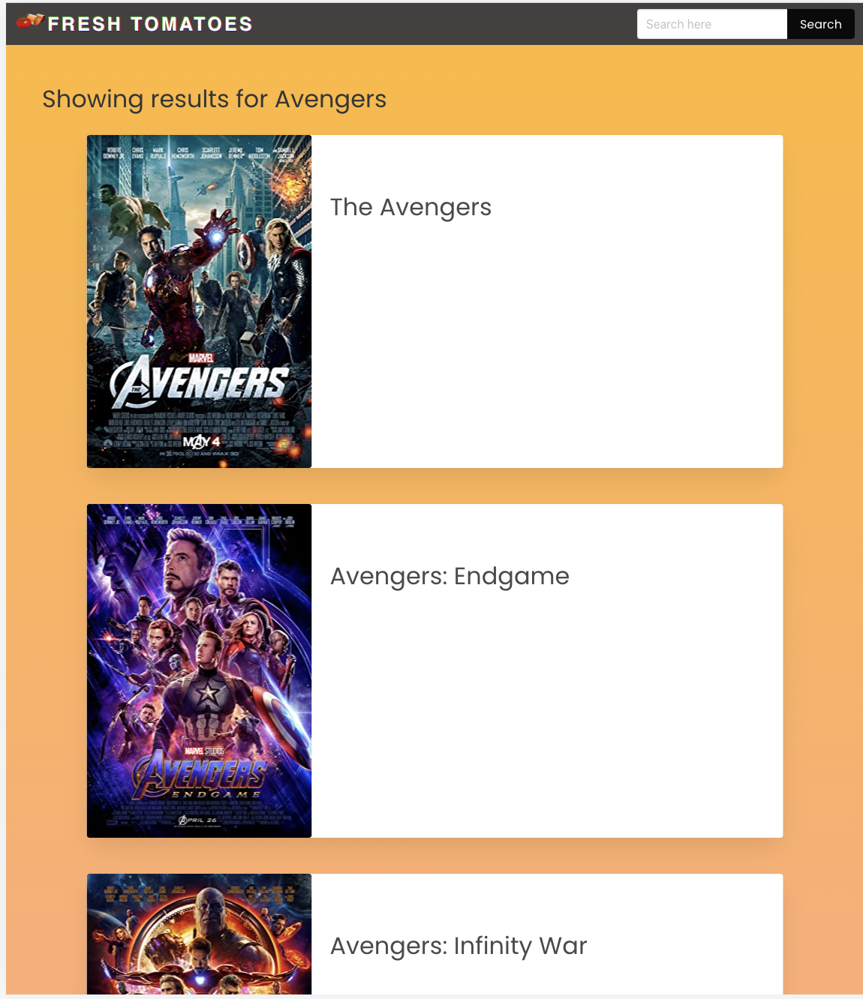
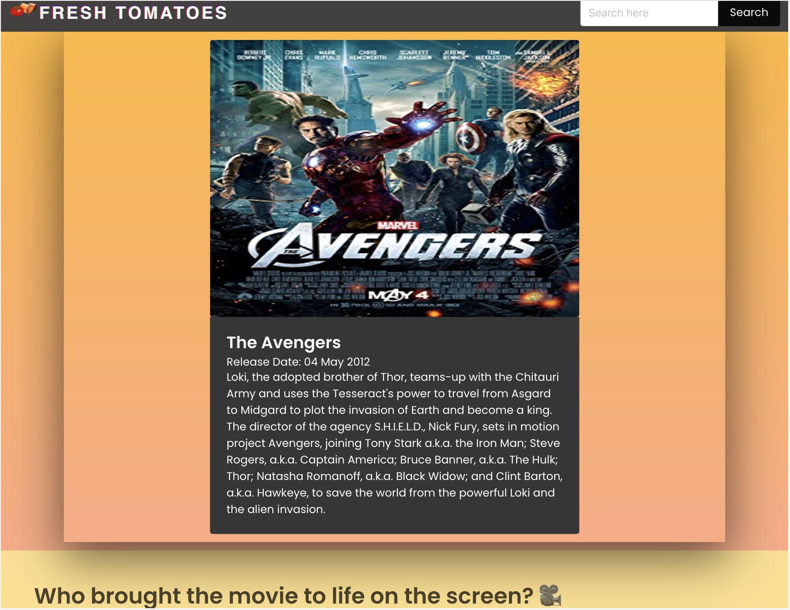

# Fresh Tomatoes
A webpage for searching movie information

  

## Project Descriptions
1. We created a home page where all the popular movies are fetched from API and displayed.
2. The home page has options to search movies based on keywords in the movie title.
3. All the movies display a movie poster, movie name, movie details, and actors.
4. When users click on movie details, an overview of the movie is displayed
### Possible Future Features
5. If a user does not have an account,he/she can signup and create a new account.
6. In the sign up page, users will have to fill all input field, password and confirm-password should be same. Passwords are savd as a hash not as text in the database.When user logs in,the password user inputs will be matched with the hashed password.
7. We have created 2 tables in the database. One for storing the users details and second for storing the movie ratings.
8. A rating table that saves the ratings along with the logged in User’s user Id and movieId(Fetched from the API)

## User Story
AS A movie watcher
I WANT to find information on my favorite movies 
SO THAT I can have deeper insight on what they are about

## Frameworks implemented
- Bulma
- jQuery

## Server Side APIs
- OMDb API
- Wikipedia API

## Built With
- HTML
- CSS
- Javascript

## Installation

N/A

## Usage

Visit this web address to see the github deployed page for the repo https://hadscloud.github.io/fresh-tomatoes/

Using chrome as the browser for the web page, right click on it and click inspect to use Chrome DevTools to inspect the html and CSS.

This is an image of the deployed website:

## Collaborators
- [Connor McGrath](https://github.com/CJMerit)
- [Hadleigh McLeod](https://github.com/hadscloud)
- [John Pinto](https://github.com/jpinto2)
- [Iqbal Ahmadi](https://github.com/IqbalAhmadi)
